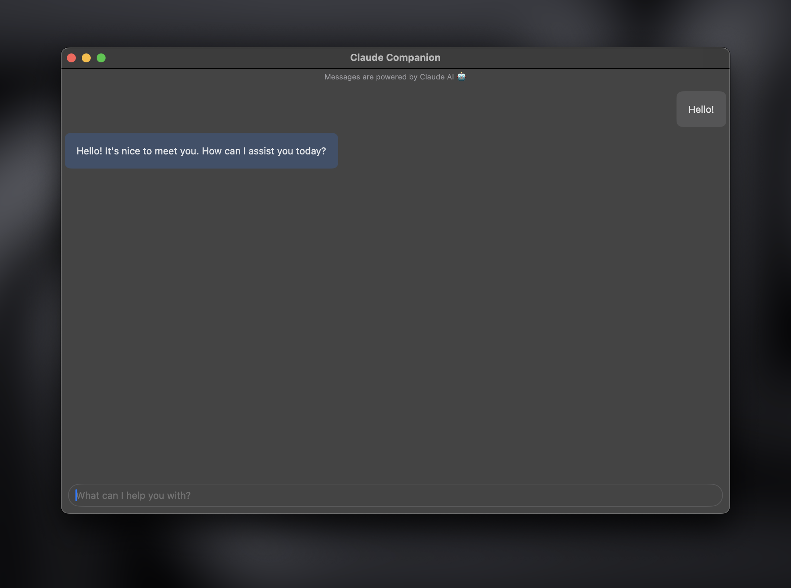

# Claude-Companion

Claude-Companion is a sophisticated macOS chatbot application powered by Claude AI's API. Seamlessly integrated with Xcode, it offers users an intuitive interface that looks and feels native to macOS. Engage in meaningful conversations, seek assistance, or simply enjoy casual chats with Claude Companion, your intelligent virtual companion right on your desktop.


## Run Locally

Clone the project

```bash
  git clone https://github.com/cluzier/Claude-Companion.git
```

- Open the `.xcodeproj` file in xcode

- Edit the `ClaudeAPI` file and insert your claude api key on line 4

- Build and run the MacOS application

## Screenshots



## Authors

- [@cluzier](https://www.github.com/cluzier)
